# Ex.07 Software Product Company Website
## Date:
13.11.2023
## AIM:
To develop a static company website to display the softwares and services provided by the company.

## DESIGN STEPS:

### Step 1:
Requirement collection.

### Step 2:
Creating the layout using HTML and CSS.

### Step 3:
Updating the sample content.

### Step 4:
Choose the appropriate style and color scheme.

### Step 5:
Validate the layout in various browsers.

### Step 6:
Validate the HTML code.

### Step 7:
Publish the website in the given URL.

## PROGRAM:

### index.html
```
<html lang="en">
<head>
    <meta charset="UTF-8">
    <meta name="viewport" content="width=device-width, initial-scale=1.0">
    <link rel="stylesheet" href="style.css">
    <title>Techiato | Home</title>
</head>
<body>
    <div class="home">
        <nav class="nav">
            <div class="navi">
                <div class="logo"><h1>Techiato</h1></div>
                <ul>
                    <li><a href="#">Home</a></li>
                    <li><a href="prod.html">Products</a></li>
                    <li><a href="asso.html">Associates</a></li>
                    <li><a href="contact.html">Contact us</a></li>
                </ul>
            </div>
        </nav>
        <div class="banner">    
        </div>
        <div class="head">
            <center>        
                <h1>Empowering Your Digital Future</h1>
                <hr width="150px">
                <p>At Techiato, we transcend boundaries, turning ideas into groundbreaking solutions. 
                    <br><br>As a leading software company, we thrive on pushing the limits of what technology can achieve. </p>
            </center>
        </div>
        <div class="main">
            <div class="image">
                
            </div>
            <center>
                <div class="content">
                    <h2>Your Gateway to Innovative Software Solutions!</h2>
                    <hr width="60px"> 
                    <p>At Techiato, we're passionate about harnessing the power of technology to drive innovation and transform businesses. 
                        <br>Our mission is to empower organizations with cutting-edge software solutions that streamline processes, enhance productivity, and unlock new possibilities. <br><br>
                        With a team of talented and dedicated professionals, we've earned a reputation for excellence in the software industry. 
                        <br><br>We combine creativity, technical expertise, and a commitment to client success to deliver software that truly makes a difference. 
                </div>
            </center>
        </div>
            <div class="ceo">                 
                <table cellspacing="10" class="t1">
                    <center>
                        <tr><th style="text-align: center; margin-left: 130px; font-size: 23px; color: #776B5D;">Meet the Founder & CEO!<hr width="50px"></th>
                            <th style="text-align: center;margin-right: 300px; font-size: 25px; color: #776B5D;">Know more about Techiato<hr width="100px"></th>
                            
                            </th>
                        </tr>
                    <tr>
                        <td style="border: 1px solid black; border-radius: 20px; padding: 15px;">
                            
                            
                            
                            <p style="text-align: center;"><i >" Techiato was founded with a vision to bridge the gap between technology and innovation. "</i><br><br><br>
                                -Lara Sidney (CEO)</p>
                        </td>
                        
                        <td width="900px" >
                            
                            <p style="text-align: center; font-size: 18px;">We take pride in our team of experienced developers, designers, 
                                <br><br>and engineers who work collaboratively to deliver software solutions that stand out. <br> 
                            <br>With a strong focus on transparency, communication, and client-centricity,<br><br> we build lasting relationships with our customers.</p>                        
                            <p style="text-align: center; font-size: 18px;">Explore our website to discover the full range of services we offer,<br><br> from custom software development to cloud solutions.<br><br>
                            <br><br><b>Join us on a journey of technology-driven excellence!</b></p><br>
                            <a href="prod.html" class="btn">Learn more</a>
                        </td>
                    </tr>
                </center> 
                </table >
            </div>
            <br><br><br><br>
    </div>
    <footer class="footer">
        <p>&copy; 2023 Techiato</p>
        <p>Name: Varsha Sharon</p>
        <p>Contact: evarshasharon@gmail.com</p>
      </footer>  
</body>
</html>
```
### prod.html
```
<html lang="en">
<head>
    <meta charset="UTF-8">
    <meta name="viewport" content="width=device-width, initial-scale=1.0">
    <title>Products</title>
    <link rel="stylesheet" href="style.css">
</head>
<body>
    <div class="home">
        <nav class="nav">
        <div class="navi">
            <div class="logo"><h1>Techiato</h1></div>
            <ul>
                <li><a href="index.html">Home</a></li>
                <li><a href="#">Products</a></li>
                <li><a href="asso.html">Associates</a></li>
                <li><a href="contact.html">Contact us</a></li>
            </ul>
        </div>
    </nav>
    <div class="banner">
    </div>
    <div class="products">
        <section class="events">
            <div class="title">
                <h1>Explore the Techiato products</h1>
                <hr width="150px">
                <br>
            </div>
            <div class="row1">
                <div class="col">
                    
                    <center>
                    <h2>Techiato Windows Total Security</h2>
                    <p>Keep your online identity private wherever you go on the internet with our robust features for all devices.</p>            
                        <br>
                        <a href="" class="btn">Add to cart</a>
                    </center> 
                </div>
                <div class="col">
                    
                    <center>
                    <h2>Techiato Windows Total Security (Festive Pack)</h2>
                    <p>Keep your online identity private wherever you go on the internet with our robust features for all devices.</p>            
                        <br>
                        <a href="" class="btn">Add to cart</a>
                    </center>
                </div>
                <div class="col">
                    
                    <center>
                    <h2>Techiato Windows Internet Security</h2>
                    <p>Keep your online identity private wherever you go on the internet with our robust features for all devices.</p>            
                        <br>
                        <a href="" class="btn">Add to cart</a>
                    </center>                   
                </div>               
                <div class="col">
                    
                    <center>
                    <h2>Techiato Windows Security (essentials)</h2>
                    <p>Keep your online identity private wherever you go on the internet with our robust features for all devices.</p>            
                        <br>
                        <a href="" class="btn">Add to cart</a>
                    </center>                    
                </div>
            </div>
            <div class="row1">
                <div class="col">
                    
                    <center>
                    <h2>Techiato Anti-Virus Pro (Windows)</h2>
                    <p>Keep your online identity private wherever you go on the internet with our robust features for all devices.</p>            
                        <br>
                        <a href="" class="btn">Add to cart</a>
                    </center>                   
                </div>              
                <div class="col">
                    
                    <center>
                    <h2>Techiato Anti-Virus Pro (MAC)</h2>
                    <p>Keep your online identity private wherever you go on the internet with our robust features for all devices.</p>            
                        <br>
                        <a href="" class="btn">Add to cart</a>
                    </center>                    
                </div>
                <div class="col">
                    
                    <center>
                    <h2>Techiato Anti-Virus (Ultra Secure)</h2>
                    <p>Keep your online identity private wherever you go on the internet with our robust features for all devices.</p>            
                        <br>
                        <a href="" class="btn">Add to cart</a>
                    </center>                 
                </div>
                <div class="col">
                    
                    <center>
                    <h2>Techiato Anti-Virus for Windows Server</h2>
                    <p>Keep your online identity private wherever you go on the internet with our robust features for all devices.</p>            
                        <br>
                        <a href="" class="btn">Add to cart</a>
                    </center>                   
                </div>
            </div>
            <div class="row1">
                <div class="col">
                    
                    <center>
                    <h2>Techiato Total Security for Mobiles</h2>
                    <p>Keep your online identity private wherever you go on the internet with our robust features for all devices.</p>            
                        <br>
                        <a href="" class="btn">Add to cart</a>
                    </center>                   
                </div>
                <div class="col">
                    
                    <center>
                    <h2>Techiato Total Security for Android</h2>
                    <p>Keep your online identity private wherever you go on the internet with our robust features for all devices.</p>            
                        <br>
                        <a href="" class="btn">Add to cart</a>
                    </center>                
                </div>
                <div class="col">
                    
                    <center>
                    <h2>Techiato Internet Security (Multi-Device)</h2>
                    <p>Keep your online identity private wherever you go on the internet with our robust features for all devices.</p>            
                        <br>
                        <a href="" class="btn">Add to cart</a>
                    </center>                  
                </div>
                <div class="col">
                    
                    <center>
                    <h2>Techiato Total Security for MAC</h2>
                    <p>Keep your online identity private wherever you go on the internet with our robust features for all devices.</p>            
                        <br>
                        <a href="" class="btn">Add to cart</a>
                    </center>             
                </div>
            </div>
        </section>
        <br>
    </div>
    <footer class="footer">
        <p>&copy; 2023 Techiato</p>
        <p>Name: Varsha Sharon</p>
        <p>Contact: evarshasharon@gmail.com</p>
      </footer>
</body>
</html>
```
### asso.html
```
<html lang="en">
<head>
    <meta charset="UTF-8">
    <meta name="viewport" content="width=device-width, initial-scale=1.0">
    <title>Associates</title>
    <link rel="stylesheet" href="style.css">
</head>
<body>
    <div class="home">
        <nav class="nav">
        <div class="navi">
            <div class="logo"><h1>Techiato</h1></div>
            <ul>
                <li><a href="index.html">Home</a></li>
                <li><a href="prod.html">Products</a></li>
                <li><a href="#">Associates</a></li>
                <li><a href="contact.html">Contact us</a></li>
            </ul>
        </div>
    </nav>
    <div class="banner">
    </div>
    <br>
    <center>
        <h1 style=" font-family: 'Segoe UI', Tahoma, Geneva, Verdana, sans-serif; color: #765827";>Meet our pals</h1>
    <hr width="150px">
    </center>
    <br>
        <table class="t2" cellspacing="20px" >
            
                <tr>
                    <td></td>
                    <td><h2>Alaska Kennedy</h2> 
                    <h3><u>Software Development Team Lead</u></h3>
                <p> I'm responsible for overseeing the entire software development process. <br> I'll lead a team of developers, set project timelines, and ensure the successful delivery of high-quality software products.  </p></td>
                </tr>
                <tr>
                    <td></td>
                    <td><h2>Adrian McCullen</h2> 
                        <h3><u>Senior Software Engineer</u></h3>
                        <p>As a Senior Software Engineer at Techiato, <br> I'm a key contributor to the development of our software products. <br>I am responsible for designing and implementing complex features, solving technical challenges, and ensuring code quality and scalability. </p>
                    </td>
                </tr>
                <tr>
                    <td></td>
                    <td><h2>Eleanor Bennett</h2> 
                        <h3><u>Product Manager</u></h3>
                        <p>Hi there! I'm the Product Manager at Techiato, <br> I am responsible for driving the product strategy and ensuring the successful delivery of software products that meet customer needs. </p>
                </td>
                </tr>
        </table>
        <footer class="footer">
            <p>&copy; 2023 Techiato</p>
            <p>Name: Varsha Sharon</p>
            <p>Contact: evarshasharon@gmail.com</p>
          </footer>
</body>
</html>
```
### contact.html
```
<html lang="en">
<head>
    <meta charset="UTF-8">
    <meta name="viewport" content="width=device-width, initial-scale=1.0">
    <title>Contact Us</title>
    <link rel="stylesheet" href="style.css">
</head>
<body>
    <div class="home">
        <nav class="nav">
        <div class="navi">
            <div class="logo"><h1>Techiato</h1></div>
            <ul>
                <li><a href="index.html">Home</a></li>
                <li><a href="prod.html">Products</a></li>
                <li><a href="asso.html">Associates</a></li>
                <li><a href="#">Contact us</a></li>
            </ul>
        </div>
    </nav>
    <div class="banner">
    </div>
    <br>
    <center>
        <h1 style=" font-family: 'Segoe UI', Tahoma, Geneva, Verdana, sans-serif; color: #765827";>Contact Us</h1>
    <hr width="150px">
    </center>
    <div class="forms">
        <form action="#" method="post">
            <label for="name">Name:</label>
            <input type="text" id="name" name="name" required>
      
            <label for="email">Email:</label>
            <input type="email" id="email" name="email" required>
      
            <label for="country">Country:</label>
            <input type="text" id="country" name="country" required>
      
            <label for="query">Query:</label>
            <textarea id="query" name="query" rows="4" required></textarea>
      
            <input type="submit" value="Submit">
          </form>
    </div>
    <footer class="footer">
        <p>&copy; 2023 Techiato</p>
        <p>Name: Varsha Sharon</p>
        <p>Contact: evarshasharon@gmail.com</p>
      </footer>
</body>
</html>
```
### style.css
```

.home{
    background-image: linear-gradient(to top, rgba(191, 244, 252, 0.164) ,rgba(252, 241, 253, 0.381), rgba(208, 203, 197, 0.381));
}
.nav{
    background-color: #f3eeea9b;
    padding-left: 15px;
    padding-right: 15px;  
}
.navi{
    display:flex ;
    justify-content: space-between;

}
.logo{
    font-size: 20px;
    margin-left: 10px;
    font-family: 'Gill Sans', 'Gill Sans MT', Calibri, 'Trebuchet MS', sans-serif;
}

ul{
    font-family: 'Lucida Sans', 'Lucida Sans Regular', 'Lucida Grande', 'Lucida Sans Unicode', Geneva, Verdana, sans-serif;
    margin-top: 25px;
    font-size: 20px;
}
li{

    margin-right: 20px;
    display: inline-block;
}
li a{
    border-radius: 20px;
    color: rgb(0, 0, 0);
    margin-right: 10px;
    padding: 10px 20px;
    list-style-type: none;
    text-decoration: none;
}
li a:hover{
    background-color: rgba(141, 141, 141, 0.185);
    color: rgb(63, 10, 72);
}
.head{
    font-family: 'Segoe UI', Tahoma, Geneva, Verdana, sans-serif;
}
.head h1{
    color: #776B5D;
}
.main{
    margin: 40px;
    height: 400px;
    border-radius: 10px;
    background-image: linear-gradient(to right, #ebe3d55c ,#bca98789);
}
.image img{
    float: right;
    margin: 20px;
    border-radius: 20px;
    margin-right: 50px;
    height: 360px;
    width: 500px;

}
.content{
    font-family: 'Gill Sans', 'Gill Sans MT', Calibri, 'Trebuchet MS', sans-serif;
    float: left;
    width:50%;
    height: 300px;
    margin: 20px;
    padding: 20px;
}
.ceo{
    font-family: 'Segoe UI', Tahoma, Geneva, Verdana, sans-serif;
    text-align: center;
    align-items: center;
}
.ceo img{
    display: block;
    margin-left: auto;
    margin-right: auto;
    width: 300px;
    height: 300px;
}
.btn{
    text-decoration: none;
    text-align: center;
    display: block;
    margin-left: auto;
    margin-right: auto;
    background-color: #e5c284;
    border: none;
    padding: 10px;
    font-size: 1rem;
    width: 8em;
    border-radius: 1rem;
    color: rgb(0, 0, 0);

}
.t1{
    margin: 40px;
}
.products{
    font-family: 'Segoe UI', Tahoma, Geneva, Verdana, sans-serif ;
}
section{
    width: 90%;
    margin: 80px auto;
    align-items: center;
}
.title{
    text-align: center;
    font-size: 4vmin;
    color: #765827;
}
.row1{
    align-items: center;
    padding: 20px;
    display: flex;
    align-items: center;
    width: 100%;
    justify-content: space-between;
    background-color: rgba(251, 225, 191, 0.235);
}
.row1 .col{
    margin: 10px;
    padding: 10px;
    display: flex;
    flex-direction: column;
    align-items: center;
}
.events .row{
    margin-top: 30px;
}
.banner{
    background-image: url("images/ban.jpg");
    background-size: cover;
    background-position: center center;
    top: 100px;
    height: 70vh;
}
.col img{
    height: 300px;
    width: 300px;
}
.t2{
    font-family: 'Segoe UI', Tahoma, Geneva, Verdana, sans-serif ;
    margin-left: 100px;
}
.t2 td{
    width: 500px;
}
.t2 img{
    height: 200px;
    width: 200px;
    margin-left: 100px;
}
.forms{
    max-width: 400px;
    margin: 50px auto;
    padding: 40px;
    background-color: #eac6961f;
    border-radius: 20px;
}
form {
    display: flex;
    flex-direction: column;
  }
  
  label {
    margin-bottom: 8px;
    color: #333;
  }
  
  input, textarea {
    padding: 10px;
    margin-bottom: 16px;
    border: 1px solid #ccc;
    border-radius: 4px;
  }
  
  input[type="submit"] {
    background-color: #007BFF;
    color: #fff;
    cursor: pointer;
    transition: background-color 0.3s;
  }
  .footer {
    background-color: #333;
    color: #fff;
    padding: 10px;
    text-align: center;

    bottom: 0;
    width: 100%;
  }
  
```
## OUTPUT:

### Home Page
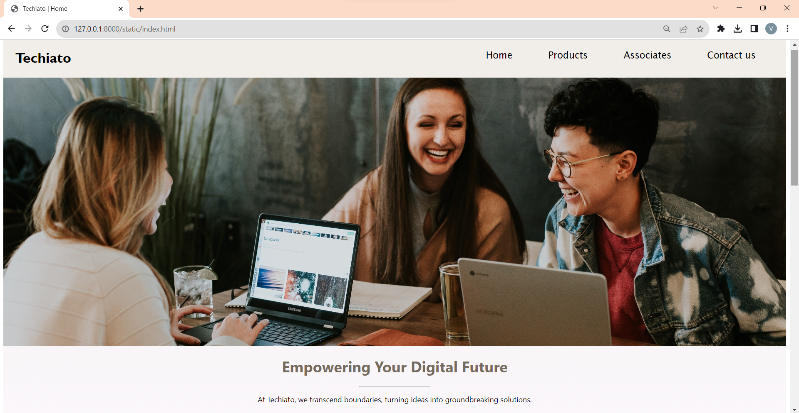
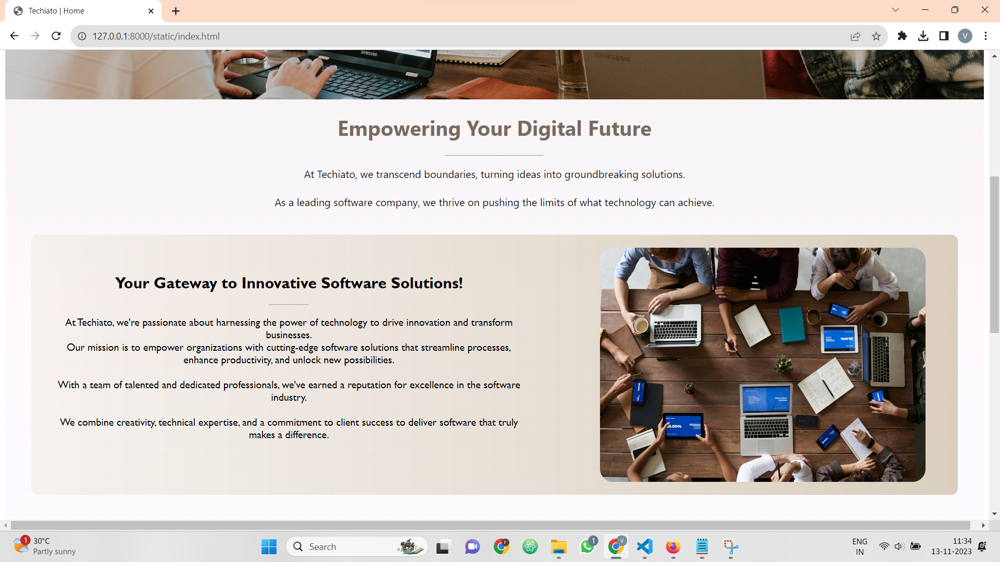
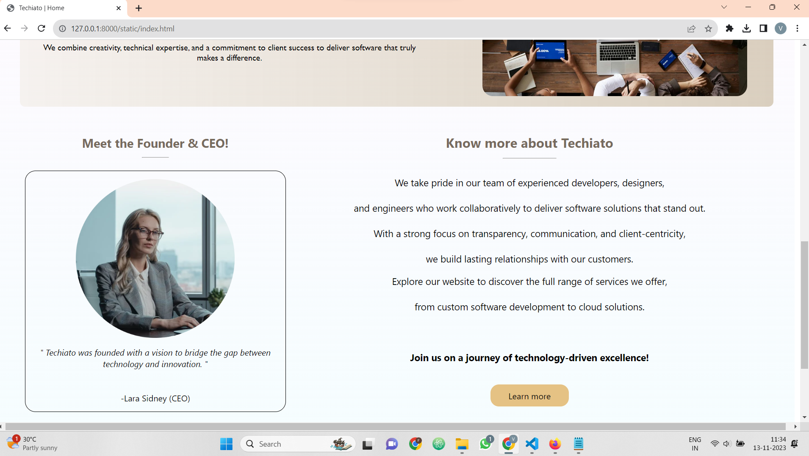
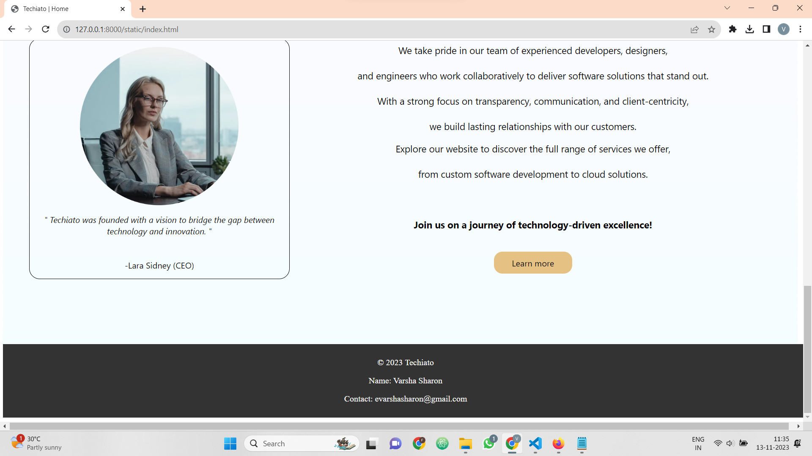

### Products Page
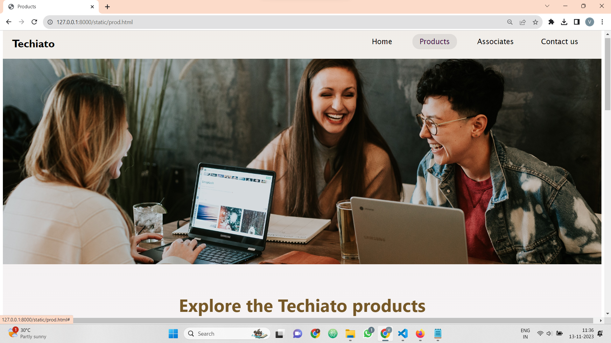
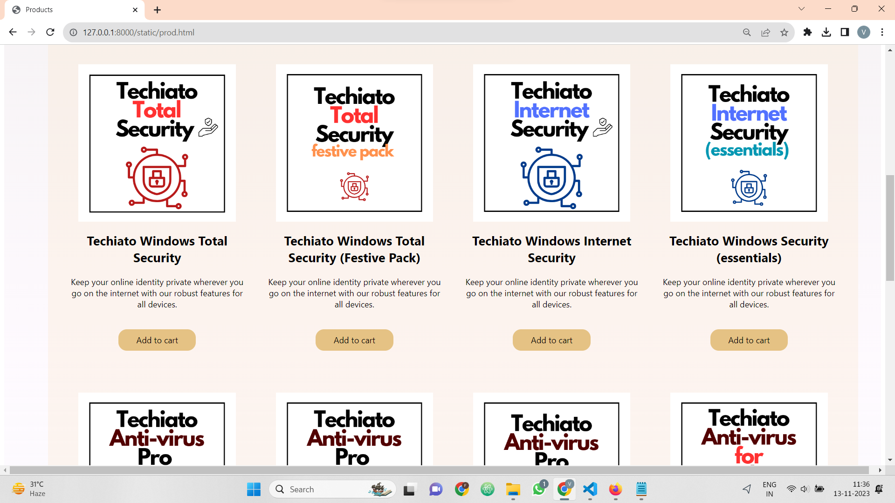
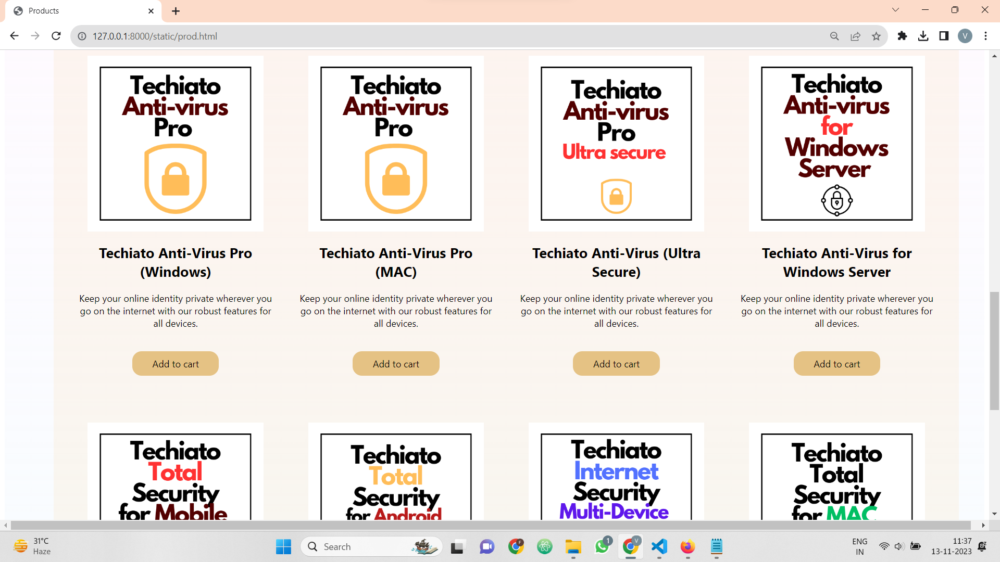
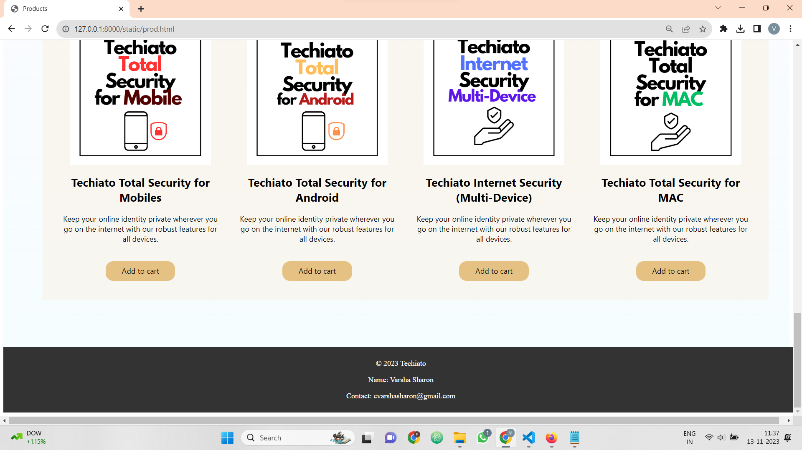

### Associates Page
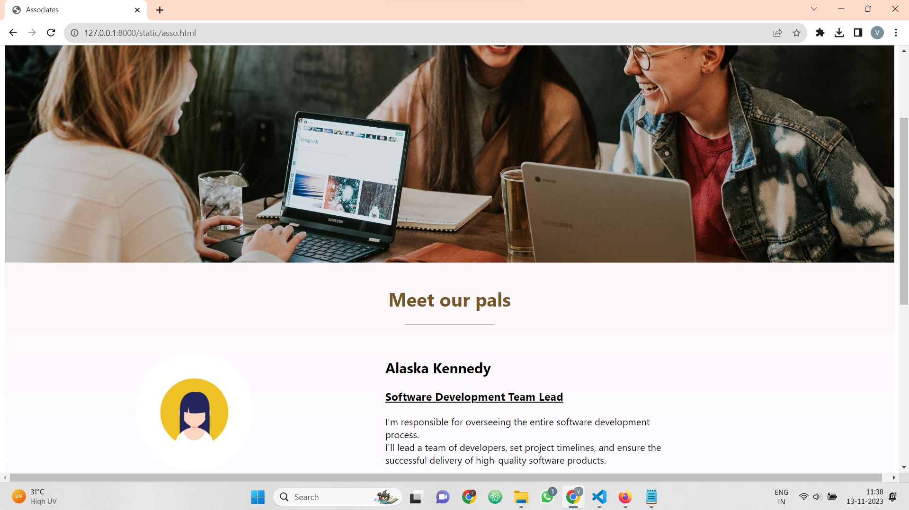
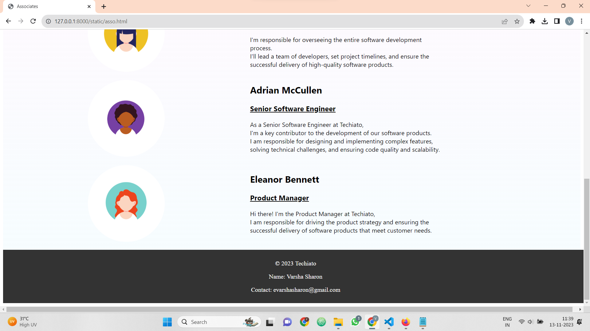

### Contact Us Page
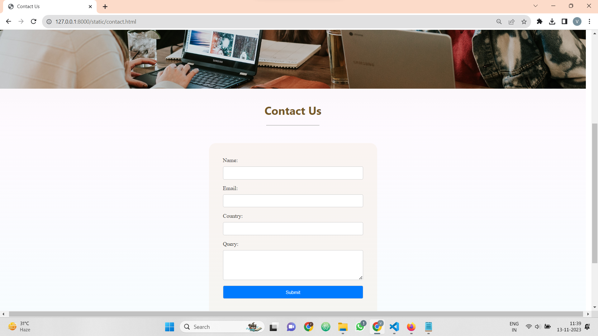

## RESULT:
The program for designing software company website using HTML and CSS is completed successfully.
